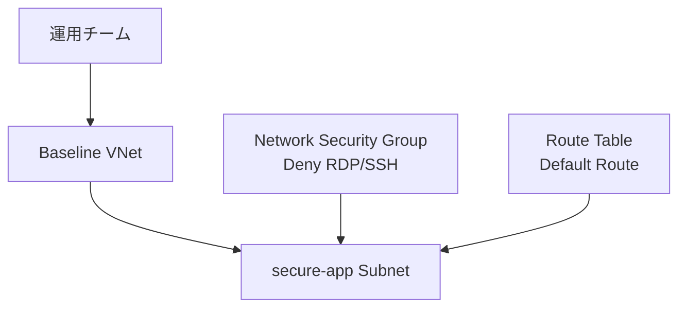

# security-baseline アーキテクチャ

## 概要
セキュリティベースラインとして NSG と Route Table を適用した VNet を構築する構成です。

## 構成図

```mermaid
flowchart TB
  VNet[Baseline VNet] --> Subnet[secure-app Subnet]
  NSG[Network Security Group\nDeny RDP/SSH] --> Subnet
  RT[Route Table\nDefault Route] --> Subnet
  Ops[運用チーム] --> VNet
```

## 主要ポイント
- NSG で RDP/SSH のインバウンドを遮断。
- 既定経路は Route Table で統制。
- 既定リージョンは southwestasia。
